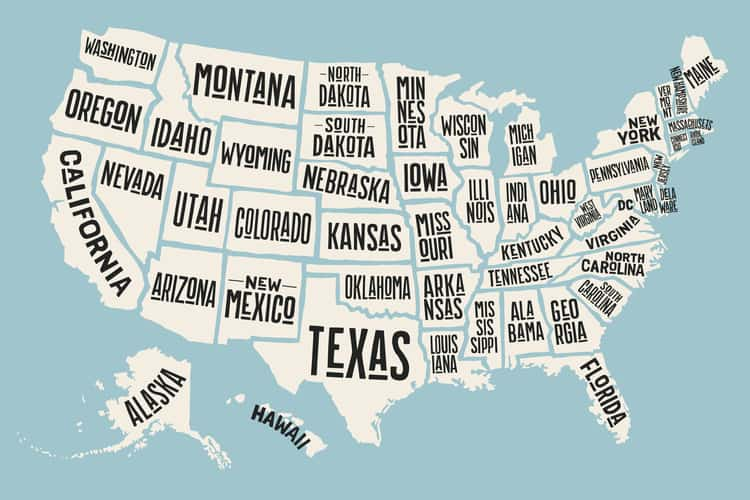

# Project 2: Shiny App Development Version 2.0     
###Term: Spring 2020     
### A Socioeconomic Guide to the USA



### Project Description
+ **A Socioeconomic Guide to the USA**
+ Team #7
+ Team members:
	+ Zidi Hong
	+ Yuqiao Liu
	+ Michael Petkun
	+ Vikki Sui
	+ Jinxu Xiang

+ [**Shiny App Link**](https://zh2404.shinyapps.io/shiny_app_group7/)

+ **Project summary**: The United States is a nation of wide geographic and economic diversity. While high-level statistics may illustrate broad patterns in the country's well-being, one must explore trends on a more granular level to truly understand regional economic health. With that in mind, this app is a tool for real estate developers and investors who are looking for areas that are ripe for investment. For example, a developer of luxury buildings may envision opportunities in counties with high income levels and a growing population. A speculative investor, on the other hand, may seek undervalued investments in areas with high, but falling, unemployment or poverty rates. This app gives users the tools to discover these opportunities by identifying and further examining states and counties that exhibit certain characteristics from a wide array of economic data.

+ **Data Source**: This app uses data from [data.gov](https://catalog.data.gov/dataset/county-level-data-sets), specifically four state-level and county-level socioeconomic data sets:
	+ Education data collected by the U.S. Census Bureau and American Community Survey
	+ Unemployment data collected by the U.S. Bureau of Labor Statistics, Local Area Unemployment Statistics (LAUS) Program
	+ Poverty estimates from the U.S. Census Bureau, Small Area Income and Poverty Estimates (SAIPE) Program
	+ Population estimates from the U.S. Census Bureau

+ **Contribution statement**: All team members contributed equally to this project. Each one has procided an interesting dataset and the final dataset we used was selected by voting. The topic, content, and the page design are all done by the discussion of the whole team. Besides, each one take the responsibility of their own page including the ui and server side to make sure that everyone can learn the whole process of building a shinyapp, but we also help each other when we have some problems during coding.  Below is a more specific work assignment of each member:
	+ Zidi Hong was the lead developer of the "Analyze a State/County" tab.
	+ Yuqiao Liu was the lead developer of the "State Map" tab.
	+ Michael Petkun originated the idea for the app and most of the analysis, performed data processing, and wrote the "Home" and "Reference" tabs.
	+ Vikki Sui was the lead developer of the "Compare States/Counties" tab. 
	+ Jinxu Xiang was the lead developer of the "County Map" tab.
	+ All team members approve our work presented in this GitHub repository, including this contribution statement. 

Following [suggestions](http://nicercode.github.io/blog/2013-04-05-projects/) by [RICH FITZJOHN](http://nicercode.github.io/about/#Team) (@richfitz). This folder is orgarnized as follows.

```
proj/
├── app/
├── lib/
├── data/
├── doc/
└── output/
```

Please see each subfolder for a README file.
